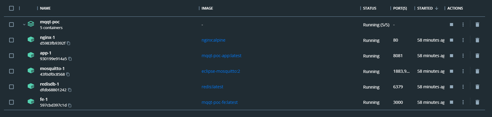
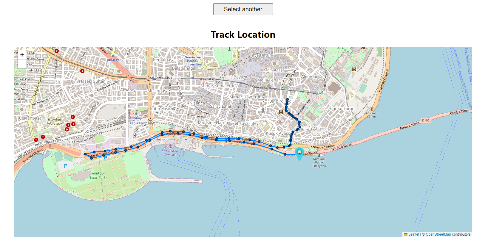
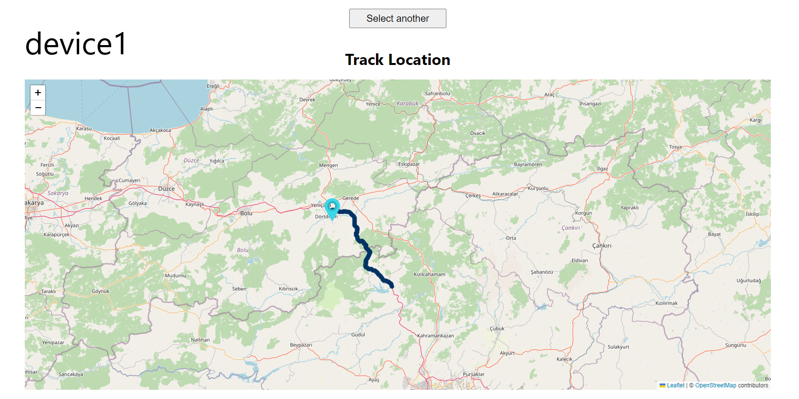
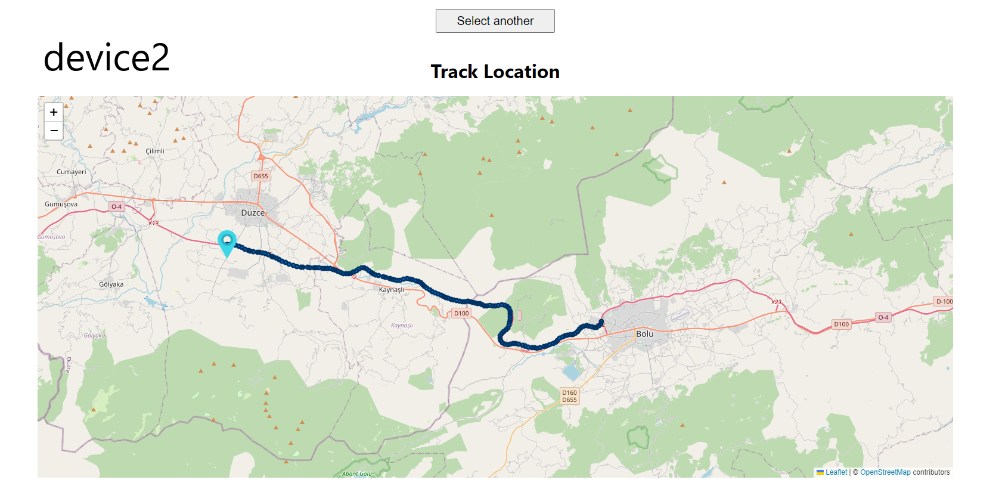

# Mosquitto MQTT - Spring Boot & Android & React JS Location Tracking App

#### The Project consists of 3 parts:

- Backend: Java Spring Boot
- Frontend: React JS
- Mobile: Android Kotlin

#### Technologies

- Spring Boot
- Server Sent Events
- Mosquitto MQQT Server
- Redis


### How to run ~project is completely dockerized

#### backend will work on port 8081 in docker and 8080 in localhost!

#### clone the project: https://github.com/gurkanucar/mqtt-example

```bash
  git clone https://github.com/gurkanucar/mqtt-example
```

#### Please firstly run this maven command to get jar file:

```bash
  cd backend
  mvn clean package -DskipTests
```

```bash
  cd ..
```


#### if you want to run it in local

```bash
  docker-compose up --build --force-recreate -d
```

#### if you want to run it in server give your ip address as arg for frontend

```bash
  EC2_IP=<MACHINE_IP> docker-compose up --build --force-recreate -d
```


#### You can access the frontend from http://localhost:3000

#### ! Don't forget to update the backend address in the mobile application.


## Example Video

[https://youtu.be/WXTXZTauM7A](https://youtu.be/WXTXZTauM7A)


## Example Images







